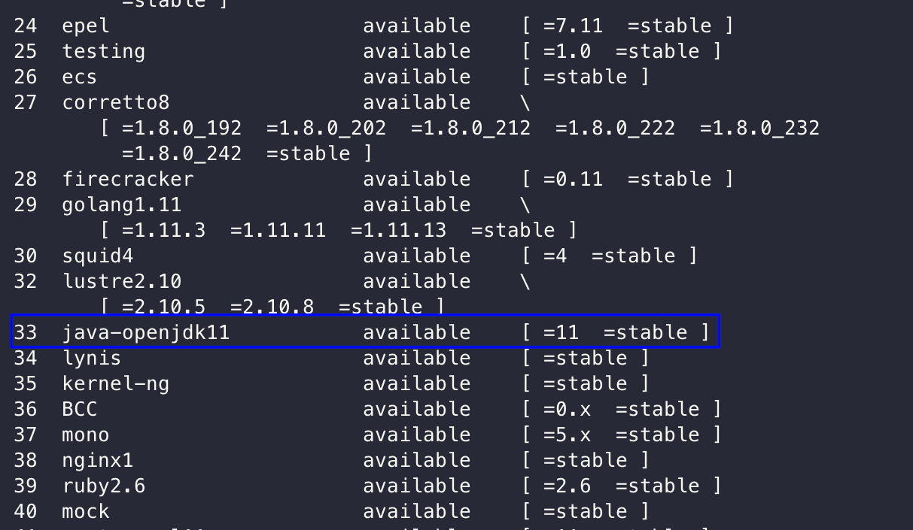

# AWS EC2 접속 및 Java11 설치

### EC2 접속

터미널을 키고 키페어가 있는 폴더로 이동


### EC2 키페어 권한 설정
처음 키페어를 생성했을 경우 권한 설정을 해야합니다.

```bash
$ chmod 400 myapp-root-key.pem
```


### EC2 접속
SSH 명령어로 서버에 접속하시면 됩니다.


### java 11 설치

Amazon linux2 에서 java11 설치를 쉽게 제공해줍니다. 



amazon-linux-extras 명령어를 사용하여 java11를 설치합니다.

```bash
$ sudo amazon-linux-extras install java-openjdk11 -y
```

설치된 java 버전을 확인해봅니다.

```bash
$ java-version
```


