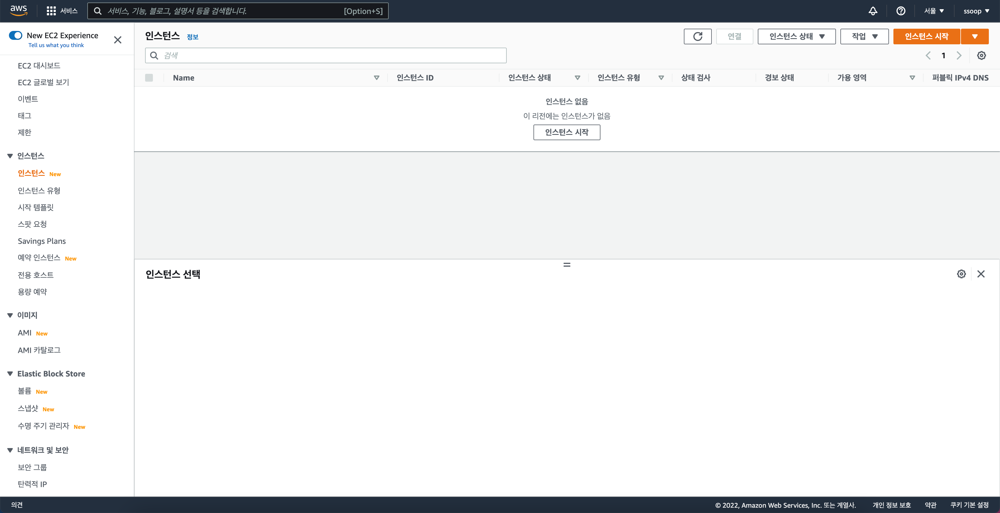
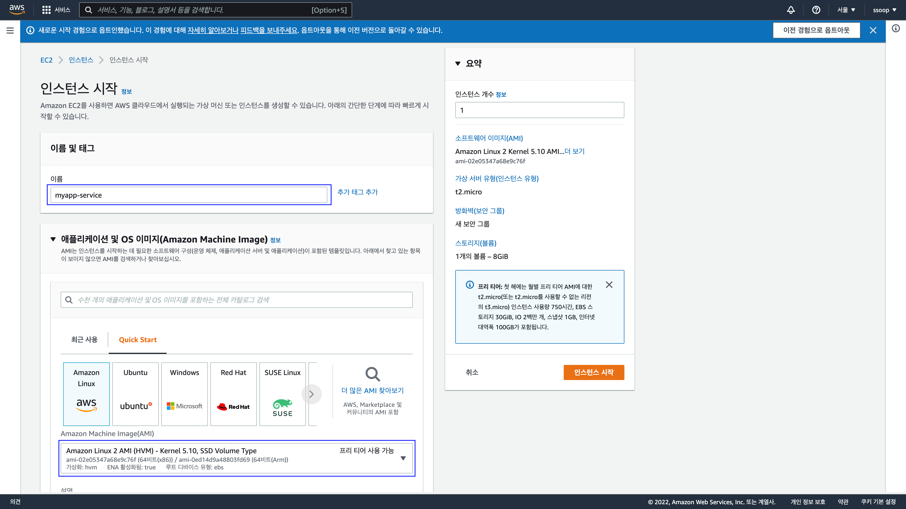
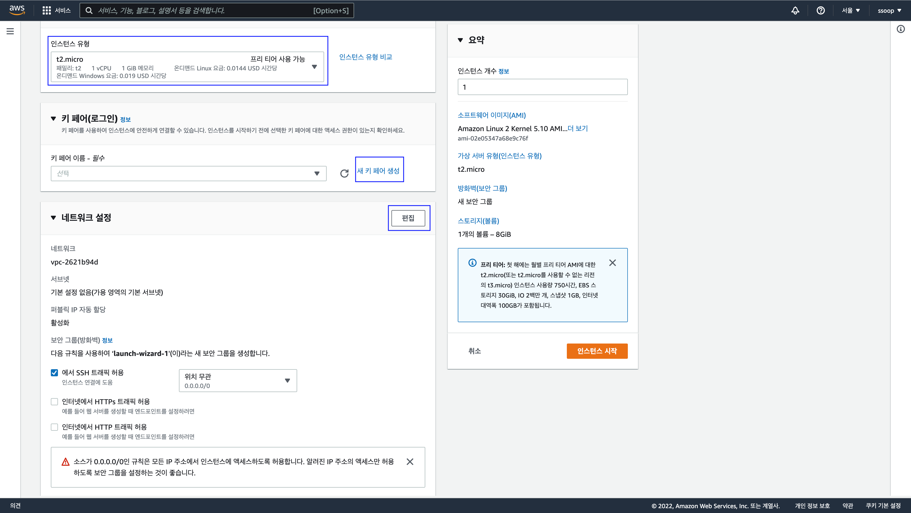
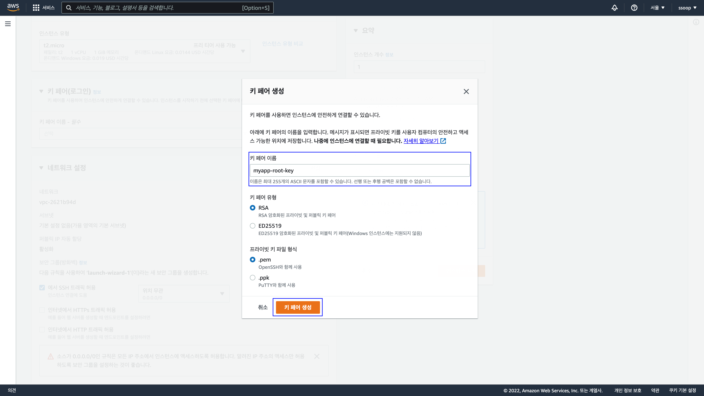
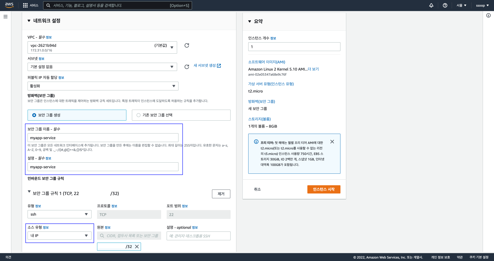
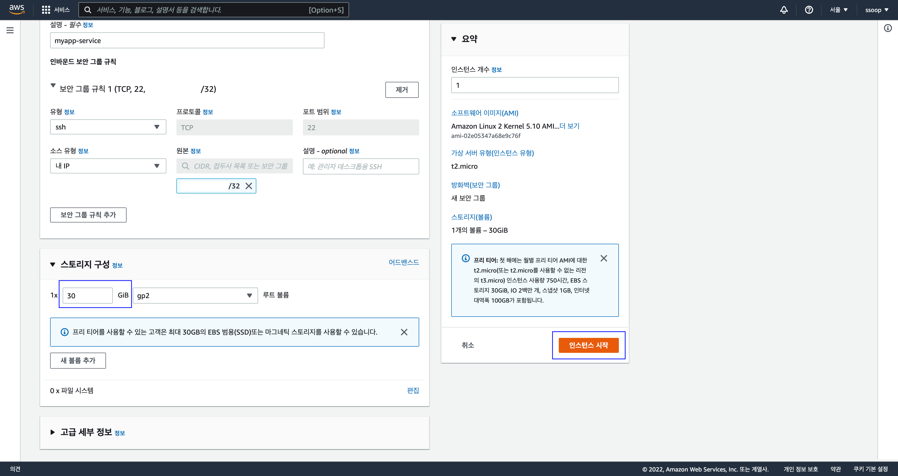
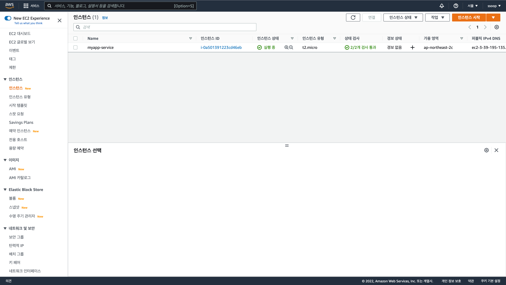

# AWS EC2 생성

### 인스턴스 시작

### EC2 이름 및 인스턴스 선택
서비스 이름을 입력합니다.  
Amazon Linux 2 AMI 를 선택합니다. (안건드셔도 됩니다.)

### 인스턴스 유형 선택, 키페어 생성, 네트워크 설정
인스턴스 유형은 프리티어인 t2.micro를 선택합니다.

### 키페어 생성
이미 키페어가 있다면 키페어를 선택해주시면 됩니다.  
키페어가 없으시면 키페어 이름을 입력하고 생성하시면 됩니다.  
생성 이후에 서버에 접속할 때 필요한 키라고 보시면 됩니다.

### 보안그룹 설정
방화벽 설정이라고 생각하시면 되고 보안그룹 이름, 설명을 입력합니다.  
터미널로 SSH로 서버에 접속하기 때문에,  
SSH 22포트는 내 IP에서만 접속허용하겠습니다.

### 스토리지 구성
하드디스크라고 생각하시면 됩니다.  
프리티어 최대인 30GiB로 입력하고 인스턴스 시작을 클릭합니다.

### 인스턴스 생성 완료

