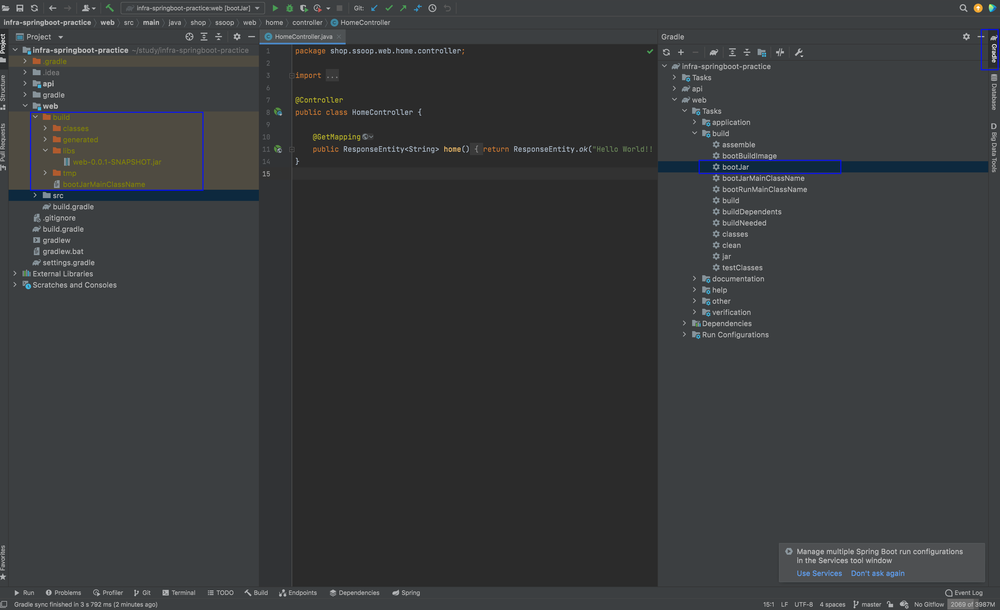
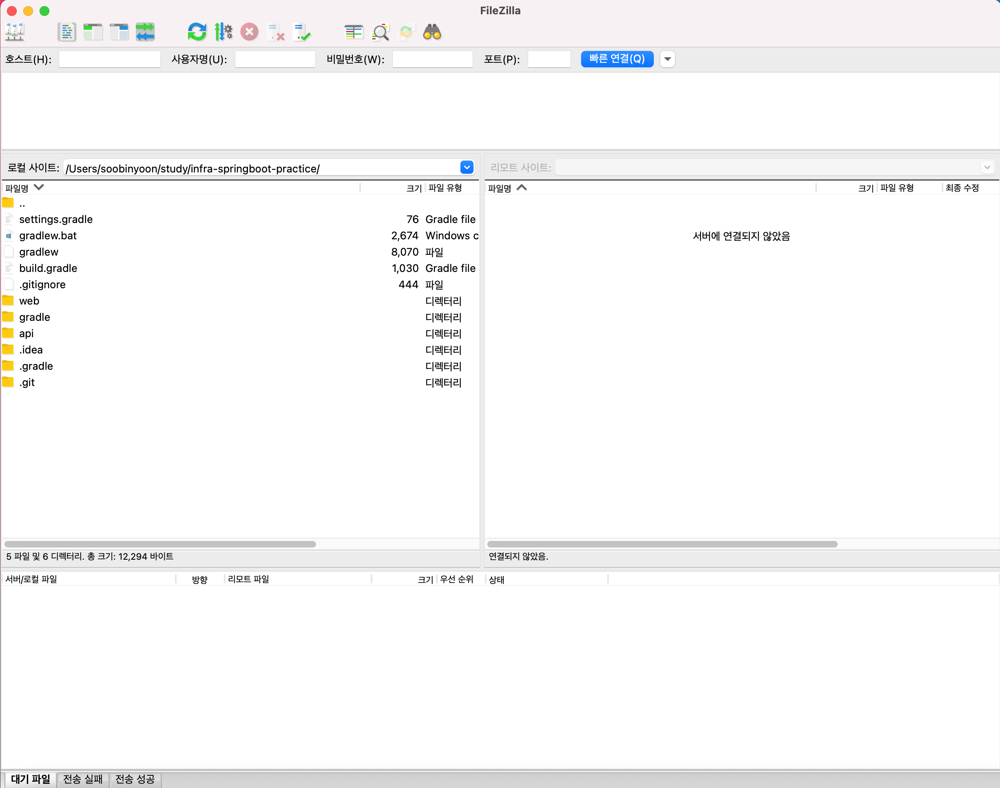
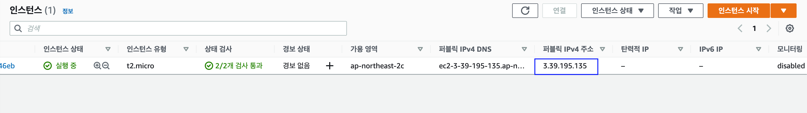
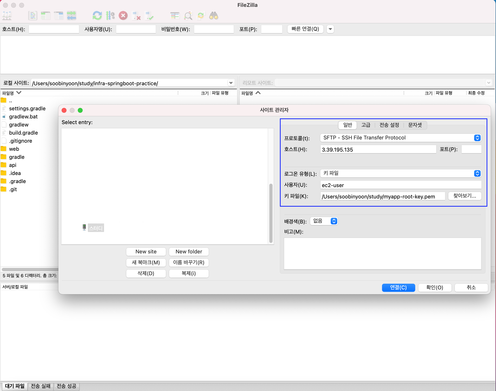
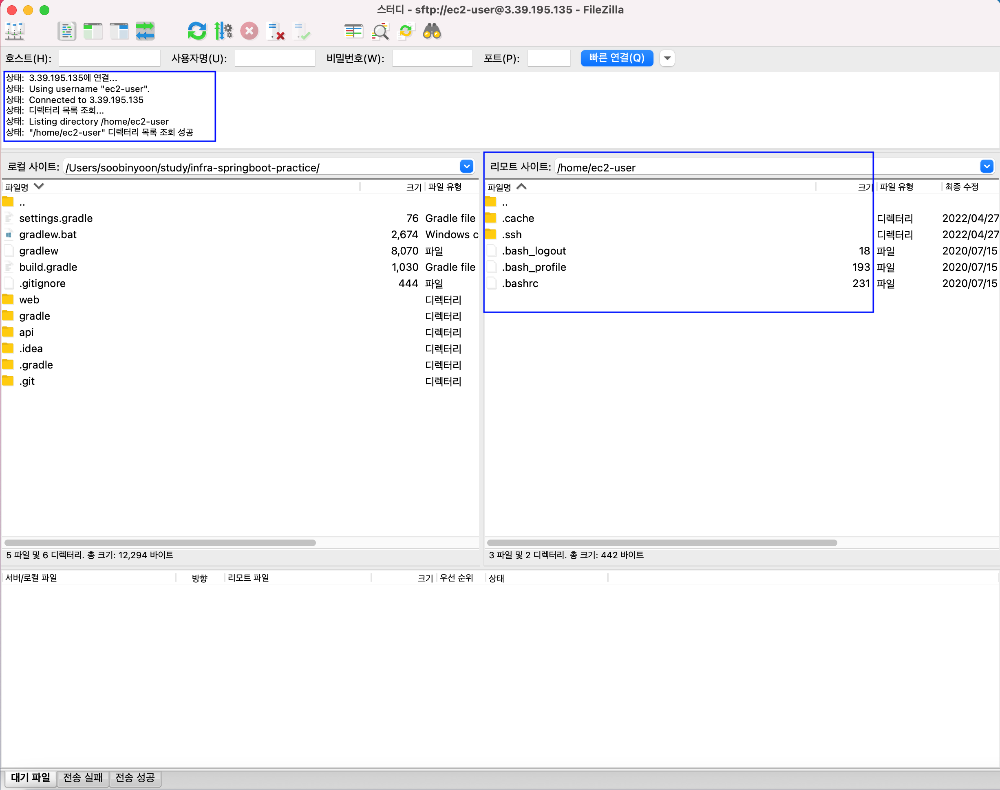
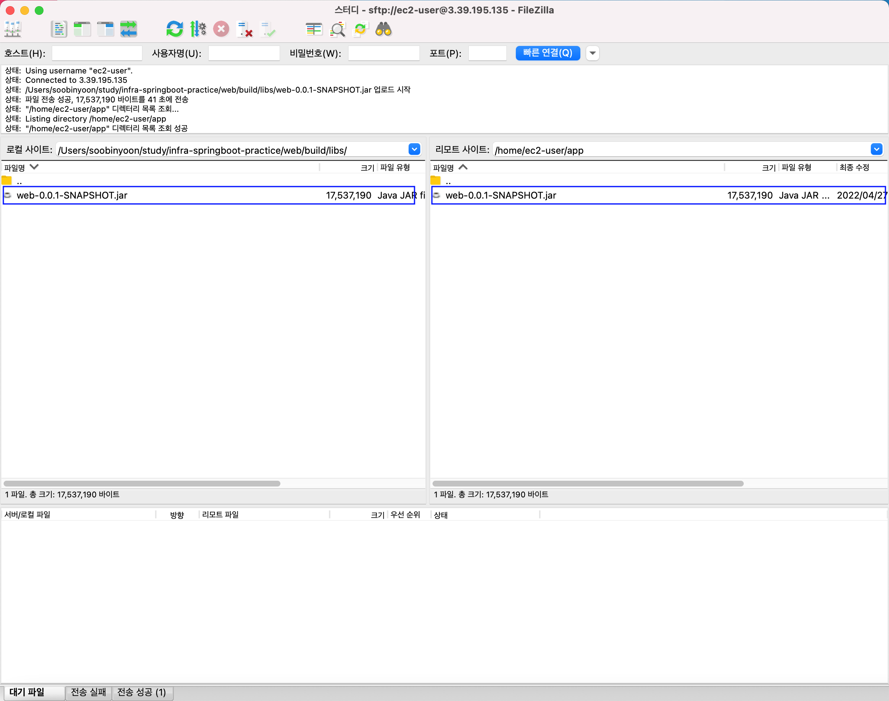
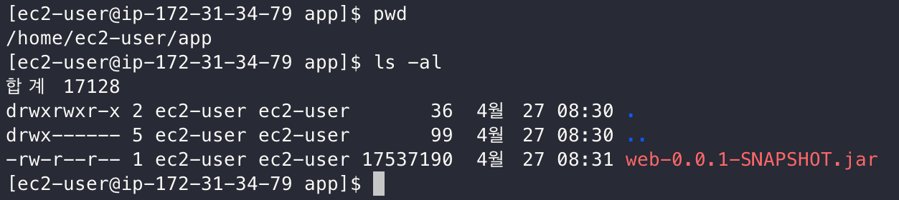
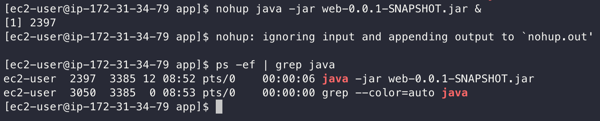
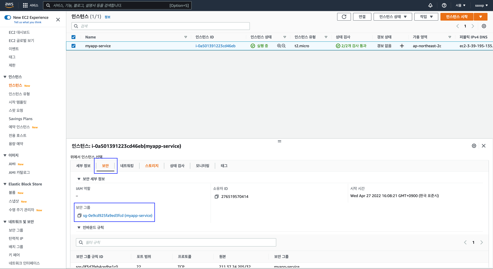
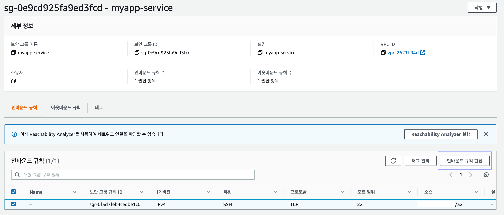

# 파일질라를 사용하여 배포

여기에서는 간단한 Springboot로 만든 서비스를 배포하려고합니다.  
SpringBoot Project는 [Github](https://github.com/ssoop-yoon/infra-springboot-practice) 에서 다운받을 수 있습니다.  
IntelliJ를 사용하기 때문에 IntelliJ를 사용하여 배포를 진행합니다.

### SpringBoot Jar 파일 생성 

서비스를 배포하기 위해 Jar파일을 만듭니다.  
Gradle > bootJar 을 클릭하시면 Jar 파일이 생성됩니다.  
**build/libs/web-0.0.1-SNAPSHOT.jar** 이 생성된 것을 확인 할 수 있습니다.




### 파일질라로 EC2 접속하기

파일질라 프로그램이 없다면 [다운로드](https://filezilla-project.org/) 받으시면 됩니다.



이전에 만든 EC2의 IP를 복사합니다.



상단의 맨 왼쪽에 있는 **사이트 관리자** 를 클릭하여 아래 이미지와 같이 설정합니다.  
SFTP 방식으로 파일을 전송하기 때문에 프로토콜은 **SFTP**를 설정해주시면 됩니다.  
호스트는 복사한 **EC2 IP** 주소를 넣으시면 됩니다.  

로그인 유형은 **키파일**로 설정해주시고 **pem키가 있는 디렉토리**를 설정해줍니다.  
다 완료되셨다면 연결 누르면 성공적으로 연결된 것을 확인 할 수 있습니다.



왼쪽에는 내 컴퓨터 영역이고 오른쪽은 EC2 서버컴퓨터입니다.



EC2 서버에서 디렉토리(app)을 생성하신 후, jar 파일을 업로드하시면 됩니다.



실제로 터미널로 접속하여 확인해보시면 정상적으로 jar파일이 업로드된 것을 확인 할 수 있습니다.



jar 파일을 실행합니다.

```bash
$ nohup java -jar web-0.0.1-SNAPSHOT.jar &
```


웹사이트에 접속하기 전에 보안그룹 8080 포트를 열어줘야합니다.  
SpringBoot가 8080포트로 실행되고 있기 때문입니다.

AWS 사이트에 들어가셔서 보안그룹에 8080 포트를 추가해줍시다.



보안그룹에서 인바운드 규칙 편집을 클릭합니다.



인바운드 규칙 편집에서 8080 포트를 모든 곳에서 접근이 가능하도록 0.0.0.0으로 열어줍니다.  
추후 nginx 을 통하여 80 -> 8080 포트로 프록시 설정을 할 것이기 때문에   
미리 http 80포트까지 추가합니다. 


보안그룹 설정을 완료했다면 접속해보시면 정상적으로 웹사이트가 뜨는 것을 확인할 수 있습니다.


