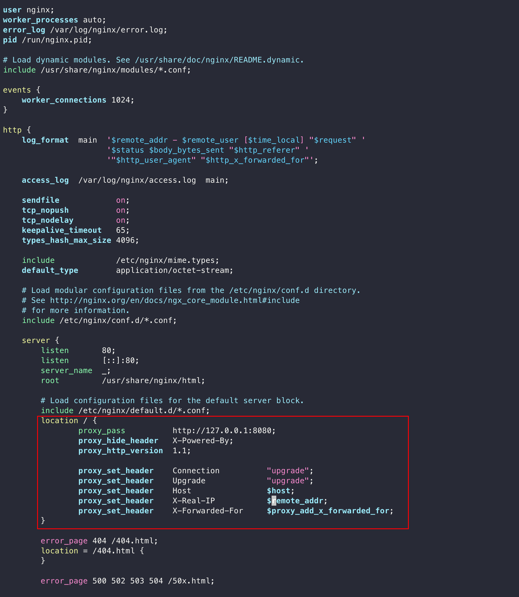
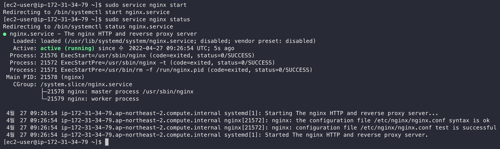

# EC2 Nginx 설치하기

### nginx 설치 

다음 명령어로 nginx를 설치합니다.

```bash
$ sudo amazon-linux-extras install nginx1 -y
```

nginx가 성공적으로 설치되었는지 버전을 확인해봅니다.
```bash
$ nginx -version
```

이제 Nginx 환경 설정을 하겠습니다.
```bash
$ sudo vi /etc/nginx/nginx.conf
```

80 포트로 접속하면 8080포트로 프록시하도록 설정합니다.



```bash
location / {
      proxy_pass          http://127.0.0.1:8080;
      proxy_hide_header   X-Powered-By;
      proxy_http_version  1.1;
    
      proxy_set_header    Connection          "upgrade";
      proxy_set_header    Upgrade             "upgrade";
      proxy_set_header    Host                $host;
      proxy_set_header    X-Real-IP           $remote_addr;
      proxy_set_header    X-Forwarded-For     $proxy_add_x_forwarded_for;
}
```

설정을 완료했다면 저장하고 Ngnix를 시작합니다.

```bash
$ sudo service nginx start
```

Nginx가 정상적으로 시작됐는지 상태를 확인해봅니다.
```bash
$ sudo service nginx status
```



이제 8080를 입력하지 않아도 정상적으로 웹사이트에 접속되시는 것을 확인할 수 있습니다.  
이제 보안그룹에서 8080포트는 삭제하도록 합니다.