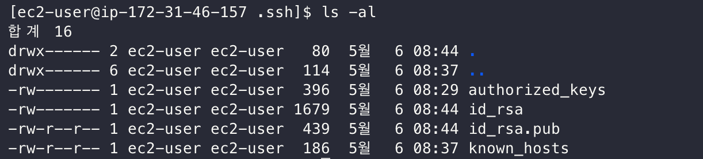
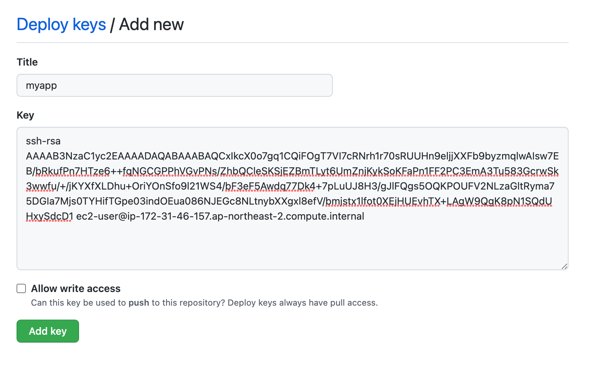

# EC2 Git으로 배포

### git 설치 및 ssh key 생성

다음 명령어로 git를 설치합니다.

```bash
$ sudo yum update -y
$ sudo yum install git -y
```

git이 성공적으로 설치되었는지 버전을 확인해봅니다.
```bash
$ git --version
```

github에 있는 Repository를 배포하겠습니다.  
설치하기 전에, SSH Key 등록을 해야합니다.

EC2로 접속하셔서 ssh key를 생성하겠습니다.
```bash
$ cd .ssh
$ ssh-keygen -t rsa
```


비밀번호 입력하지 않고 Enter로 모두 넘어갑니다.

완료되셨다면 `ls -al` 명령어로 잘 생성되었는지 확인합니다.



### github

* Private으로 만든 Repository이어야 합니다.

Github의 Setting 페이지로 이동합니다.


Deploy keys -> Add deploy key 버튼을 클릭합니다.

위에서 만든 ssh 공개키를 등록해야합니다.
```bash
$ cat ~/.ssh/id_rsa.pub
```
해당 키를 복사하여 아래의 이미지처럼 추가해줍니다.



키 등록이 완료되었으면 EC2에서 소스를 clone 받아서 배포하면 됩니다.


### ec2 배포

`app`이라는 폴더를 만든 후 git clone을 받아보도록 하겠습니다.

```bash
$ mkdir app
$ cd app
$ git git@github.com:ssoop-yoon/private-infra-springboot-practice.git
```


성공적으로 소스를 받으셨다면 Jar파일 생성 후 배포하면 됩니다.